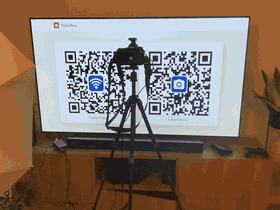
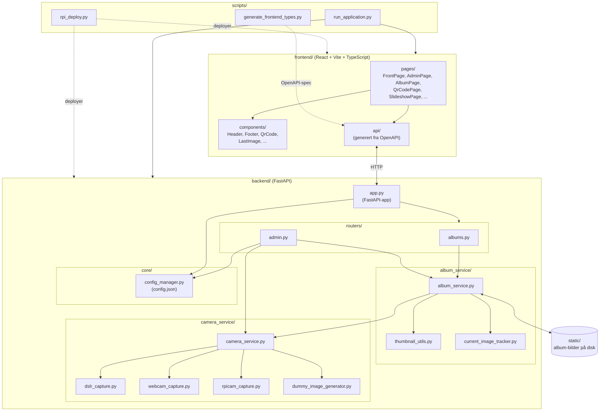

# BildeBua
BildeBua er en hjemmelaget "Photobooth" der man kan scanne en QR-kode og bruke mobilen til å ta et bilde.

Du kan bruke BildeBua både med webkamera på Mac, Raspberry PI Camera Module eller speilreflekskamera. Ideelt sett kjører man på en Raspberry PI med speilrefleks.

BildeBua er ment å kjøres på lokalt WiFi-nett for enkelheten og sikkerhetens skyld. Hvis det er brukere som ikke har WiFi-passordet fra før kan BildeBua vise en WiFi-QR-kode etter man har lagt inn WiFi-navn og passord.

Når du først har fått applikasjonen opp og kjøre, er det ganske lett å endre på instillinger fra admin-siden.

# Kodestruktur

Applikasjonen består av en React-frontend som snakker med en FastAPI-backend over HTTP. Backend bruker en album-tjeneste som lagrer bilder på disk og en kamera-tjeneste som velger riktig kamera-implementasjon basert på konfigurasjonen.

# Docs
- [Oppsett for lokal utvikling](docs/lokal_utvikling.md#lokal-utvikling)
- [Oppsett på Raspberry PI fra scratch](docs/oppsett_av_raspberry_pi.md)
